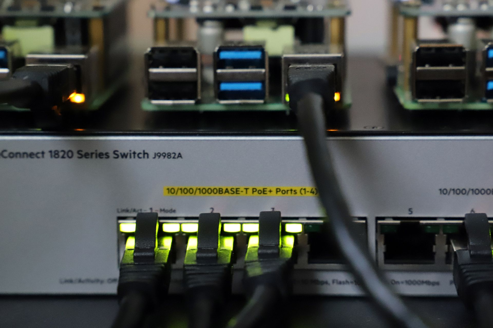

My goal was to cool the Raspberry Pi as well as to reduce the volume. So the Raspberry PI only cools when it gets too hot. At the same time I can display information on the display so I don't have to log in via SSH to get the status.



I use a Raspberry PI 4 with [WaveShare PoE HAT (B)](https://www.waveshare.com/wiki/PoE_HAT_(B)).

Theoretical maximum temperature values are about 80C° before the Raspberry PI starts downclocking the CPU. Above 90-95C° damage can occur.

When idle, the Raspberry PI is about 40C° with the small heatsinks and the fan turned off. If there is a load now, the fan on the PoE HAT should be switched on and cool the Raspberry PI 4 additionally.

To keep my wish of a CPU temperature of around 50C° the fan is switched on from a CPU operating temperature of 50C° and stays switched on until the temperature is below 50C° again.

# Prerequisites 

## Install system dependencies

```bash
sudo apt install gcc git g++
```

## Install node.js on your raspebrry pi

```bash
sudo apt install nodejs
```

or a specified version

```
sudo curl -sL https://deb.nodesource.com/setup_14.x | sudo -E bash -
sudo apt update
sudo apt install nodejs
``` 

## Activate I2C-Interface

Use `raspi-config` as command when connected to ssh to enable the I2C interface (Interface Options) on your Raspberry Pi.

## Set switch to P0 on POE HAT

When mounting the Waveshare POE HAT, you will need to set the switch to P0 so we can program it later.


> *  EN for an automatic start of the fan when booting the Raspberry PI.
> * P0 to be able to program the fan without automatic start.

## Install npm Packages

Run the following command in the source folder.

```bash
npm install i2c-bus oled-i2c-bus oled-font-5x7 --save
```

Alternative

```bash
npm install
```

# Check temperature continuously (RUN)

You can run the script with 

```bash
node app.js
```

The best way to implement it is to register the script as a cronjob.

```bash
crontab -e

*/5 * * * * node /home/pi/raspberryPi-waveshare-PoE-HAT-B/app.js
```
